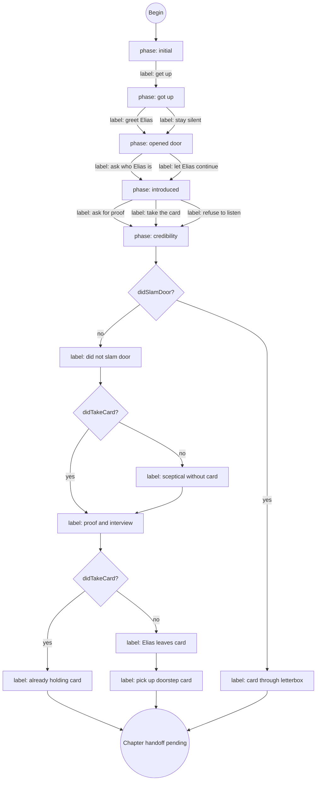

# Chapter 1: Prologue

```mermaid
flowchart TD
    start((Begin))

    initial["phase: initial"]
    got_up["phase: got up"]
    opened_door["phase: opened door"]
    introduced["phase: introduced"]
    credibility["phase: credibility"]
    end_node((Chapter handoff pending))

    slammed{"didSlamDoor?"}
    took_initial{"didTakeCard?"}
    proof["label: proof and interview"]
    took_departure{"didTakeCard?"}

    start --> initial
    initial -->|"label: get up"| got_up

    got_up -->|"label: greet Elias"| opened_door
    got_up -->|"label: stay silent"| opened_door

    opened_door -->|"label: ask who Elias is"| introduced
    opened_door -->|"label: let Elias continue"| introduced

    introduced -->|"label: ask for proof"| credibility
    introduced -->|"label: take the card"| credibility
    introduced -->|"label: refuse to listen"| credibility

    credibility --> slammed
    slammed -->|"yes"| letterbox["label: card through letterbox"]
    slammed -->|"no"| continues["label: did not slam door"]

    continues --> took_initial
    took_initial -->|"no"| scepticism["label: sceptical without card"]
    took_initial -->|"yes"| proof["label: proof and interview"]
    scepticism --> proof

    proof --> took_departure
    took_departure -->|"yes"| already_taken["label: already holding card"]
    took_departure -->|"no"| doorstep["label: Elias leaves card"]
    doorstep --> pickup["label: pick up doorstep card"]
    already_taken --> end_node
    pickup --> end_node
    letterbox --> end_node
```
